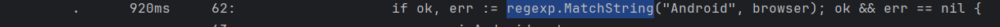
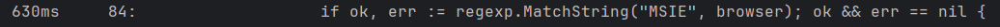
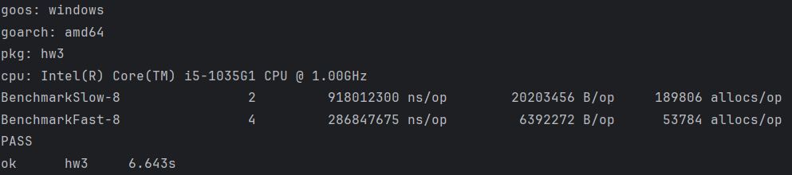
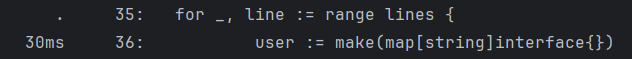

запускаем бенчмарк 
```
m -cpuprofile="cpu.out" -memprofile="mem.out" -memprofilerate=1 .
```
запускаем профилирование по цпу
```
go tool pprof hw3.test.exe cpu.out
```
смотрим производительность FastSearch
```
list FastSearch
```

- видим замедление на


Устранение повторной компиляции паттерна поиска для всех мест, где идет поиск по регулярному выражению


- видим замедление на
- 
